# 🗂️ iamhoonse-ecosystem

## 📖 개요

`iamhoonse-ecosystem`은 모노레포 관리랑 빌드를 단순화하려고 만든 템플릿이에요. 이 템플릿은 다양한 앱과 패키지를 포함하고 있어서, 팀 협업과 생산성을 높이는 데 도움을 줄 거예요.

## 📖 상세 내용

본 프로젝트에 대한 보다 상세한 내용은 GitHub Pages 에 배포된 [문서](https://iamhoonse-dev.github.io/iamhoonse-ecosystem/ko)를 참고해 주세요.

## 🔗 구성 요소 간 관계도

이 템플릿은 여러 앱과 패키지로 구성돼 있어요. 각 앱과 패키지 간의 관계는 아래의 다이어그램을 참고해 주세요.

```mermaid
graph TD
    QHZT("@iamhoonse-js/browser-utils") --> ETTT("@iamhoonse-js/eslint-config")
    QHZT("@iamhoonse-js/browser-utils") --> JEGP("@iamhoonse-js/helpers")
    QHZT("@iamhoonse-js/browser-utils") --> EMLE("@iamhoonse-js/typescript-config")
    QHZT("@iamhoonse-js/browser-utils") --> LRHC("@iamhoonse-js/vitest-config")
    GLAO("@iamhoonse-js/cli") --> ETTT("@iamhoonse-js/eslint-config")
    GLAO("@iamhoonse-js/cli") --> EMLE("@iamhoonse-js/typescript-config")
    GLAO("@iamhoonse-js/cli") --> LRHC("@iamhoonse-js/vitest-config")
    ETTT("@iamhoonse-js/eslint-config") --> VELR("@iamhoonse-js/eslint-plugin-sample")
    VELR("@iamhoonse-js/eslint-plugin-sample") --> TXWC("___ROOT___")
    JEGP("@iamhoonse-js/helpers") --> ETTT("@iamhoonse-js/eslint-config")
    JEGP("@iamhoonse-js/helpers") --> EMLE("@iamhoonse-js/typescript-config")
    WCIN("@iamhoonse-js/http-clients") --> ETTT("@iamhoonse-js/eslint-config")
    WCIN("@iamhoonse-js/http-clients") --> JEGP("@iamhoonse-js/helpers")
    WCIN("@iamhoonse-js/http-clients") --> EMLE("@iamhoonse-js/typescript-config")
    TPBW("@iamhoonse-js/node-utils") --> ETTT("@iamhoonse-js/eslint-config")
    TPBW("@iamhoonse-js/node-utils") --> JEGP("@iamhoonse-js/helpers")
    TPBW("@iamhoonse-js/node-utils") --> EMLE("@iamhoonse-js/typescript-config")
    TPBW("@iamhoonse-js/node-utils") --> LRHC("@iamhoonse-js/vitest-config")
    BHWE("@iamhoonse-js/playwright-config") --> ETTT("@iamhoonse-js/eslint-config")
    BHWE("@iamhoonse-js/playwright-config") --> EMLE("@iamhoonse-js/typescript-config")
    MKNG("@iamhoonse-js/react-ui") --> ETTT("@iamhoonse-js/eslint-config")
    MKNG("@iamhoonse-js/react-ui") --> JEGP("@iamhoonse-js/helpers")
    MKNG("@iamhoonse-js/react-ui") --> EMLE("@iamhoonse-js/typescript-config")
    MKNG("@iamhoonse-js/react-ui") --> LRHC("@iamhoonse-js/vitest-config")
    IRKD("@iamhoonse-js/react-utils") --> QHZT("@iamhoonse-js/browser-utils")
    EMLE("@iamhoonse-js/typescript-config") --> TXWC("___ROOT___")
    UWBQ("@iamhoonse-js/ui") --> ETTT("@iamhoonse-js/eslint-config")
    UWBQ("@iamhoonse-js/ui") --> EMLE("@iamhoonse-js/typescript-config")
    LRHC("@iamhoonse-js/vitest-config") --> EMLE("@iamhoonse-js/typescript-config")
    FBWM("docs") --> ETTT("@iamhoonse-js/eslint-config")
    FBWM("docs") --> EMLE("@iamhoonse-js/typescript-config")
    FBWM("docs") --> UWBQ("@iamhoonse-js/ui")
    NRTE("frontend-workshop") --> ETTT("@iamhoonse-js/eslint-config")
    NRTE("frontend-workshop") --> MKNG("@iamhoonse-js/react-ui")
    GVMR("lighthouse-ci") --> ETTT("@iamhoonse-js/eslint-config")
    ITTZ("playwright-web") --> ETTT("@iamhoonse-js/eslint-config")
    ITTZ("playwright-web") --> BHWE("@iamhoonse-js/playwright-config")
    ITTZ("playwright-web") --> EMLE("@iamhoonse-js/typescript-config")
    ITTZ("playwright-web") --> VXGS("web")
    WWDL("portfolio") --> QHZT("@iamhoonse-js/browser-utils")
    WWDL("portfolio") --> ETTT("@iamhoonse-js/eslint-config")
    WWDL("portfolio") --> WCIN("@iamhoonse-js/http-clients")
    WWDL("portfolio") --> TPBW("@iamhoonse-js/node-utils")
    WWDL("portfolio") --> MKNG("@iamhoonse-js/react-ui")
    WWDL("portfolio") --> IRKD("@iamhoonse-js/react-utils")
    WWDL("portfolio") --> EMLE("@iamhoonse-js/typescript-config")
    WWDL("portfolio") --> UWBQ("@iamhoonse-js/ui")
    WWDL("portfolio") --> LRHC("@iamhoonse-js/vitest-config")
    VXGS("web") --> QHZT("@iamhoonse-js/browser-utils")
    VXGS("web") --> ETTT("@iamhoonse-js/eslint-config")
    VXGS("web") --> WCIN("@iamhoonse-js/http-clients")
    VXGS("web") --> TPBW("@iamhoonse-js/node-utils")
    VXGS("web") --> MKNG("@iamhoonse-js/react-ui")
    VXGS("web") --> IRKD("@iamhoonse-js/react-utils")
    VXGS("web") --> EMLE("@iamhoonse-js/typescript-config")
    VXGS("web") --> UWBQ("@iamhoonse-js/ui")
    VXGS("web") --> LRHC("@iamhoonse-js/vitest-config")
```

> 💡 **참고:**  
> 이 다이어그램은 [Mermaid](https://mermaid-js.github.io/mermaid/#/)를 사용해서 그렸어요. 이 도구는 텍스트 기반으로 다이어그램을 그릴 수 있게 해줘요. 아래의 코드를 복사해서 [Mermaid Live Editor](https://mermaid-js.github.io/mermaid-live-editor/)에 붙여넣으면 다이어그램을 시각적으로 확인할 수 있어요.

## 📦 구성 요소

### 🖥️ Apps

이 섹션은 다양한 애플리케이션을 포함하고 있어요. 각 앱은 특정 목적을 위해 설계되었으며, Next.js와 같은 최신 기술 스택을 활용하고 있어요.

| 이름                                              | 배포 환경                                     | 배포 URL                                               | 설명                                                                            |
| ------------------------------------------------- | --------------------------------------------- | ------------------------------------------------------ | ------------------------------------------------------------------------------- |
| **[Docs](./apps/docs)**                           | [GitHub Pages](https://pages.github.com/)     | https://iamhoonse-dev.github.io/iamhoonse-ecosystem/ko | Next.js 및 Nextra를 사용한 문서 사이트에요. 이 모노레포에 대한 문서를 제공해요. |
| **[Web](./apps/web)**                             |                                               |                                                        | Next.js 기반의 웹 애플리케이션이에요.                                           |
| **[Frontend Workshop](./apps/frontend-workshop)** | [AWS Amplify](https://aws.amazon.com/amplify) | https://storybook.iamhoonse.dev                        | 컴포넌트 개발이랑 테스트를 위한 Storybook 환경이에요.                           |
| **[Portfolio](./apps/portfolio)**                 | [AWS Amplify](https://aws.amazon.com/amplify) | https://portfolio.iamhoonse.dev                        | 개인 포트폴리오 및 소개를 위한 Next.js 기반 앱이에요.                           |

### 📦 Packages

이 섹션은 재사용 가능한 패키지 모음을 포함하고 있어요. 각 패키지는 특정 기능을 제공하며, 모노레포 구조에서 독립적으로 관리돼요.
또한, 이곳에 있는 패키지들 중 일부는 [npm](https://npmjs.org)에 배포될 수 있도록 설정되어 있어요.

| 이름                                                                                                                                                                                                                | 번들 크기                                                                                             | 설명                                                        |
| ------------------------------------------------------------------------------------------------------------------------------------------------------------------------------------------------------------------- | ----------------------------------------------------------------------------------------------------- | ----------------------------------------------------------- |
| **[Browser Utils](./packages/browser-utils)**                              |         | 브라우저 관련 유틸리티 함수 모음이에요.                     |
| **[ESLint Plugin Sample](./packages/eslint-plugin-sample)**  |  | 샘플 ESLint 플러그인이에요.                                 |
| **[HTTP Clients](./packages/http-clients)**                                                                                                                                                                         |                                                                                                       | HTTP 요청을 처리하려고 만든 클라이언트 라이브러리예요.      |
| **[Node Utils](./packages/node-utils)**                                          |            | Node.js 환경에서 쓸 수 있는 유틸리티 함수 모음이에요.       |
| **[React UI](./packages/react-ui)**                                                  |              | React 기반 UI 컴포넌트 라이브러리예요.                      |
| **[React Utils](./packages/react-utils)**                                      |           | React 애플리케이션에서 쓸 수 있는 유틸리티 함수 모음이에요. |

### 🧩 Shared

이 섹션은 프로젝트 전반에서 재사용 가능한 내부 패키지를 포함하고 있어요. `shared` 디렉토리에 있는 패키지들은 npm에 배포되지 않고, 내부적으로만 사용돼요.

| 이름                            | 설명                                                                                  |
| ------------------------------- | ------------------------------------------------------------------------------------- |
| **[Helpers](./shared/helpers)** | 프로젝트 전반에서 재사용 가능한 유틸리티 함수와 공통 로직을 제공하는 내부 패키지예요. |

### 🛠️ Tools

이 섹션은 개발 및 테스트를 지원하는 도구들을 포함하고 있어요. 각 도구는 특정 작업을 자동화하거나 간소화하는 데 도움을 줘요.

| 이름                                         | 설명                                                                               |
| -------------------------------------------- | ---------------------------------------------------------------------------------- |
| **[Playwright Web](./tools/playwright-web)** | Playwright 기반의 웹 테스트 도구예요.                                              |
| **[CLI](./tools/cli)**                       | 명령줄 작업을 자동화하고 프로젝트 관리 및 개발을 지원하기 위한 도구예요.           |
| **[Lighthouse CI](./tools/lighthouse-ci)**   | 웹 애플리케이션의 성능, 접근성, SEO 등을 자동으로 측정하고 관리하기 위한 도구예요. |

### ⚙️ Configs

이 섹션은 프로젝트 전반에서 사용되는 공통 설정 파일들을 포함하고 있어요. ESLint, TypeScript, Vitest와 같은 도구들의 설정이 포함돼요.

| 이름                                                 | 설명                                       |
| ---------------------------------------------------- | ------------------------------------------ |
| **[ESLint Config](./configs/eslint-config)**         | ESLint 설정을 위한 공통 구성이에요.        |
| **[Playwright Config](./configs/playwright-config)** | Playwright 테스트 설정이에요.              |
| **[TypeScript Config](./configs/typescript-config)** | TypeScript 설정을 위한 공통 구성이에요.    |
| **[Vitest Config](./configs/vitest-config)**         | Vitest 테스트 설정을 위한 공통 구성이에요. |

## 🔀 Workflows

이 프로젝트는 다음과 같은 GitHub Actions Workflow를 포함하고 있어요:

### 🧪 **[Test](.github/workflows/test.yml)**

[`test.yml`](.github/workflows/test.yml) 파일에 정의되어 있으며, 프로젝트의 주요 테스트(유닛, E2E, Lighthouse, Storybook 등)를 통합적으로 실행해요.

- 이 Workflow는 다음과 같은 테스트를 포함해요:
  - [unit test](.github/workflows/test.yml#L13)
  - [e2e test](.github/workflows/test.yml#L167)
  - [lighthouse test](.github/workflows/test.yml#L139)
  - [storybook test](.github/workflows/test.yml#L209)
- 이들 중 e2e, lighthouse, storybook 테스트는 [`docker-compose.gha.yaml`](./docker-compose.gha.yaml) 파일을 사용해서 통합 테스트 환경을 설정해요.
- 다양한 서비스(web, playwright, lighthouse, storybook 등)를 컨테이너로 띄워 실제 서비스 환경과 유사하게 테스트를 수행해요.

### 🚀 **[Release](.github/workflows/release.yml)**

[`release.yml`](.github/workflows/release.yml) 파일에 정의되어 있으며, Changesets를 기반으로 패키지 배포를 자동화해요.

- 이 Workflow는 Changesets 봇을 사용해서 PR을 생성하고, 변경 사항을 자동으로 추적해요.
- PR을 승인하면, 변경된 패키지의 버전이 업데이트되고, `CHANGELOG.md` 파일이 생성돼요.
- 그리고 승인된 PR이 병합되면서 실행되는 Workflow에 의해, `NPM_TOKEN`을 사용하여 npm에 패키지가 배포돼요.

### 📖 [Publish GitHub Pages](.github/workflows/publish-github-pages.yml)

[`publish-github-pages.yml`](.github/workflows/publish-github-pages.yml) 파일에 정의되어 있으며, [`docs`](./apps/docs) 앱을 GitHub Pages에 배포해요.

- 이 Workflow는 `docs` 앱의 빌드를 수행하고, 빌드된 결과물을 GitHub Pages에 배포해요.
- GitHub Pages 로의 배포를 위해서는 레포지토리의 Settings 에서 Pages를 활성화해야 해요.
- 배포된 문서는 [https://<USER_ID>.github.io/<PROJECT_NAME>](https://iamhoonse-dev.github.io/turborepo-template/) 형식의 URL로 접근할 수 있어요.

## 📜 라이선스

이 프로젝트는 개인 포트폴리오, 문서 사이트, 패키지 등 본인 소유의 결과물을 공개하고,
다른 사람이 자유롭게 코드를 참고하거나 사용할 수 있도록 **MIT 라이선스** 하에 배포하고 있어요.
