# 🗂️ iamhoonse-ecosystem

## 📖 Overview

`iamhoonse-ecosystem` is a monorepo project that serves as my personal portfolio, documentation site, and package distribution. By making my own work public, it allows others to freely reference or use the code.

## 🛠️ Major External Packages/Tools Dependencies

This template relies on several external packages and tools to simplify the development environment setup and build process. Here are the main dependencies:

| Category                | Package/Tool Name & Description                                                                                           |
| ----------------------- | ------------------------------------------------------------------------------------------------------------------------ |
| **Package Manager**     | pnpm                                                                                                                     |
| **Monorepo Management** | turborepo (turbo)                                                                                                        |
| **Language/Transpiler** | typescript                                                                                                               |
| **Formatter**           | prettier                                                                                                                 |
| **Commit/Hooks**        | husky, @commitlint/cli, @commitlint/config-conventional                                                                  |
| **Linter**              | eslint                                                                                                                   |
| **Testing**             | vitest, @testing-library/react, @testing-library/dom, @testing-library/jest-dom, @testing-library/user-event, jsdom      |
| **Build/Bundler**       | next, @vitejs/plugin-react, vite-tsconfig-paths                                                                          |
| **UI Framework**        | react, react-dom                                                                                                         |
| **E2E/Performance Test**| playwright, lighthouse, lighthouse-ci                                                                                   |
| **Versioning**          | changesets                                                                                                               |
| **Documentation**       | nextra, mdx                                                                                                              |

## 🔗 Component Relationship Diagram

This template consists of multiple apps and packages. The relationships between each app and package are illustrated in the diagram below.

```mermaid
graph TD
    QHZT("@iamhoonse-js/browser-utils") --> ETTT("@iamhoonse-js/eslint-config")
    QHZT("@iamhoonse-js/browser-utils") --> JEGP("@iamhoonse-js/helpers")
    QHZT("@iamhoonse-js/browser-utils") --> EMLE("@iamhoonse-js/typescript-config")
    QHZT("@iamhoonse-js/browser-utils") --> LRHC("@iamhoonse-js/vitest-config")
    GLAO("@iamhoonse-js/cli") --> ETTT("@iamhoonse-js/eslint-config")
    GLAO("@iamhoonse-js/cli") --> EMLE("@iamhoonse-js/typescript-config")
    GLAO("@iamhoonse-js/cli") --> LRHC("@iamhoonse-js/vitest-config")
    ETTT("@iamhoonse-js/eslint-config") --> VELR("@iamhoonse-js/eslint-plugin-sample")
    VELR("@iamhoonse-js/eslint-plugin-sample") --> TXWC("___ROOT___")
    JEGP("@iamhoonse-js/helpers") --> ETTT("@iamhoonse-js/eslint-config")
    JEGP("@iamhoonse-js/helpers") --> EMLE("@iamhoonse-js/typescript-config")
    WCIN("@iamhoonse-js/http-clients") --> ETTT("@iamhoonse-js/eslint-config")
    WCIN("@iamhoonse-js/http-clients") --> JEGP("@iamhoonse-js/helpers")
    WCIN("@iamhoonse-js/http-clients") --> EMLE("@iamhoonse-js/typescript-config")
    TPBW("@iamhoonse-js/node-utils") --> ETTT("@iamhoonse-js/eslint-config")
    TPBW("@iamhoonse-js/node-utils") --> JEGP("@iamhoonse-js/helpers")
    TPBW("@iamhoonse-js/node-utils") --> EMLE("@iamhoonse-js/typescript-config")
    TPBW("@iamhoonse-js/node-utils") --> LRHC("@iamhoonse-js/vitest-config")
    BHWE("@iamhoonse-js/playwright-config") --> ETTT("@iamhoonse-js/eslint-config")
    BHWE("@iamhoonse-js/playwright-config") --> EMLE("@iamhoonse-js/typescript-config")
    MKNG("@iamhoonse-js/react-ui") --> ETTT("@iamhoonse-js/eslint-config")
    MKNG("@iamhoonse-js/react-ui") --> JEGP("@iamhoonse-js/helpers")
    MKNG("@iamhoonse-js/react-ui") --> EMLE("@iamhoonse-js/typescript-config")
    MKNG("@iamhoonse-js/react-ui") --> LRHC("@iamhoonse-js/vitest-config")
    IRKD("@iamhoonse-js/react-utils") --> QHZT("@iamhoonse-js/browser-utils")
    EMLE("@iamhoonse-js/typescript-config") --> TXWC("___ROOT___")
    UWBQ("@iamhoonse-js/ui") --> ETTT("@iamhoonse-js/eslint-config")
    UWBQ("@iamhoonse-js/ui") --> EMLE("@iamhoonse-js/typescript-config")
    LRHC("@iamhoonse-js/vitest-config") --> EMLE("@iamhoonse-js/typescript-config")
    FBWM("docs") --> ETTT("@iamhoonse-js/eslint-config")
    FBWM("docs") --> EMLE("@iamhoonse-js/typescript-config")
    FBWM("docs") --> UWBQ("@iamhoonse-js/ui")
    NRTE("frontend-workshop") --> ETTT("@iamhoonse-js/eslint-config")
    NRTE("frontend-workshop") --> MKNG("@iamhoonse-js/react-ui")
    GVMR("lighthouse-ci") --> ETTT("@iamhoonse-js/eslint-config")
    ITTZ("playwright-web") --> ETTT("@iamhoonse-js/eslint-config")
    ITTZ("playwright-web") --> BHWE("@iamhoonse-js/playwright-config")
    ITTZ("playwright-web") --> EMLE("@iamhoonse-js/typescript-config")
    ITTZ("playwright-web") --> VXGS("web")
    WWDL("portfolio") --> QHZT("@iamhoonse-js/browser-utils")
    WWDL("portfolio") --> ETTT("@iamhoonse-js/eslint-config")
    WWDL("portfolio") --> WCIN("@iamhoonse-js/http-clients")
    WWDL("portfolio") --> TPBW("@iamhoonse-js/node-utils")
    WWDL("portfolio") --> MKNG("@iamhoonse-js/react-ui")
    WWDL("portfolio") --> IRKD("@iamhoonse-js/react-utils")
    WWDL("portfolio") --> EMLE("@iamhoonse-js/typescript-config")
    WWDL("portfolio") --> UWBQ("@iamhoonse-js/ui")
    WWDL("portfolio") --> LRHC("@iamhoonse-js/vitest-config")
    VXGS("web") --> QHZT("@iamhoonse-js/browser-utils")
    VXGS("web") --> ETTT("@iamhoonse-js/eslint-config")
    VXGS("web") --> WCIN("@iamhoonse-js/http-clients")
    VXGS("web") --> TPBW("@iamhoonse-js/node-utils")
    VXGS("web") --> MKNG("@iamhoonse-js/react-ui")
    VXGS("web") --> IRKD("@iamhoonse-js/react-utils")
    VXGS("web") --> EMLE("@iamhoonse-js/typescript-config")
    VXGS("web") --> UWBQ("@iamhoonse-js/ui")
    VXGS("web") --> LRHC("@iamhoonse-js/vitest-config")
```

> 💡 **Note:**
> This diagram was created using [Mermaid](https://mermaid-js.github.io/mermaid/#/). This tool allows you to draw diagrams based on text. You can copy the code below and paste it into the [Mermaid Live Editor](https://mermaid-js.github.io/mermaid-live-editor/) to view the diagram visually.

## 📦 Components

### 🖥️ Apps

This section includes various applications. Each app is designed for a specific purpose and utilizes modern tech stacks such as Next.js.

| Name                                              | Deployment Environment                        | Deployment URL                                            | Description                                                                 |
| ------------------------------------------------- | --------------------------------------------- | -------------------------------------------------------- | --------------------------------------------------------------------------- |
| **Docs**                           | [GitHub Pages](https://pages.github.com/)     | https://iamhoonse-dev.github.io/iamhoonse-ecosystem/ko   | Documentation site using Next.js and Nextra. Provides documentation for this monorepo. |
| **Web**                             |                                               |                                                          | Web application based on Next.js.                                           |
| **Frontend Workshop** | [AWS Amplify](https://aws.amazon.com/amplify) | https://storybook.iamhoonse.dev                        | Storybook environment for component development and testing.                |
| **Portfolio**                 | [AWS Amplify](https://aws.amazon.com/amplify) | https://portfolio.iamhoonse.dev                        | Next.js-based app for personal portfolio and introduction.                  |

### 📦 Packages

This section contains a collection of reusable packages. Each package provides specific functionality and is managed independently within the monorepo.
Some of the packages here are also configured to be published to [npm](https://npmjs.org).

| Name                                                                                                                                                                                                                | Bundle Size                                                                                             | Description                                                  |
| ------------------------------------------------------------------------------------------------------------------------------------------------------------------------------------------------------------------- | ------------------------------------------------------------------------------------------------------- | ------------------------------------------------------------ |
| **Browser Utils**                              |         | A collection of browser-related utility functions.           |
| **ESLint Plugin Sample**  |  | Sample ESLint plugin.                                        |
| **HTTP Clients**                                                                                                                                                                         |                                                                                                       | Client library for handling HTTP requests.                   |
| **Node Utils**                                          |            | Utility functions for Node.js environment.                   |
| **React UI**                                                  |              | React-based UI component library.                            |
| **React Utils**                                      |           | Utility functions for React applications.                    |

### 🧩 Shared

This section contains internal packages that are reusable throughout the project. Packages in the `shared` directory are not published to npm and are used internally only.

| Name                            | Description                                                                           |
| ------------------------------- | ------------------------------------------------------------------------------------- |
| **Helpers** | Internal package providing reusable utility functions and common logic across the project. |

### 🛠️ Tools

This section includes tools that support development and testing. Each tool helps automate or simplify specific tasks.

| Name                                         | Description                                                                         |
| -------------------------------------------- | ----------------------------------------------------------------------------------- |
| **Playwright Web** | Web testing tool based on Playwright.                                               |
| **CLI**                       | Tool for automating command-line tasks and supporting project management and development. |
| **Lighthouse CI**   | Tool for automatically measuring and managing web app performance, accessibility, SEO, etc. |

### ⚙️ Configs

This section contains common configuration files used throughout the project, including settings for ESLint, TypeScript, Vitest, and more.

| Name                                                 | Description                                   |
| ---------------------------------------------------- | --------------------------------------------- |
| **ESLint Config**         | Common configuration for ESLint.                |
| **Playwright Config** | Playwright test configuration.                    |
| **TypeScript Config** | Common configuration for TypeScript.              |
| **Vitest Config**         | Common configuration for Vitest testing.        |

## 🔀 Workflows

This project includes the following GitHub Actions Workflows:

### 🧪 **Test**

Defined in the `test.yml` file, this workflow runs the main tests (unit, E2E, Lighthouse, Storybook, etc.) for the project.
This workflow includes the following tests: \
(🐳 indicates tests run in Docker containers on GitHub Actions)

- unit test
- 🐳 e2e test
- 🐳 lighthouse test
- 🐳 storybook test

### 🚀 **Release**

Defined in the `release.yml` file, this workflow automates package publishing based on Changesets.

- This workflow uses the Changesets bot to create PRs and automatically track changes.
- When the PR is approved, the version of the changed package is updated and a `CHANGELOG.md` file is generated.
- When the approved PR is merged, the workflow uses `NPM_TOKEN` to publish the package to npm.

### 📖 Publish GitHub Pages

Defined in the `publish-github-pages.yml` file, this workflow deploys the `docs` app to GitHub Pages.

- This workflow builds the `docs` app and deploys the build output to GitHub Pages.
- To deploy to GitHub Pages, you need to enable Pages in the repository's Settings.
- The deployed documentation can be accessed at a URL like [https://USER_ID.github.io/PROJECT_NAME](https://iamhoonse-dev.github.io/iamhoonse-ecosystem/ko).

## 📜 License

This project is distributed under the **MIT License** to make my personal portfolio, documentation site, packages, and other works public, allowing others to freely reference or use the code.
