# 🗂️ iamhoonse-ecosystem

## 📖 概要

`iamhoonse-ecosystem`は、私の個人ポートフォリオ、ドキュメントサイト、パッケージなどを公開し、他の人が自由にコードを参考にしたり利用できるようにしたモノレポプロジェクトです。

## 🛠️ 主な外部パッケージ/ツール依存関係

このテンプレートは、開発環境の構築やビルドプロセスを簡素化するために、さまざまな外部パッケージやツールに依存しています。主な依存関係は以下の通りです。

| カテゴリ                | パッケージ/ツール名と説明                                                                                           |
| ----------------------- | ------------------------------------------------------------------------------------------------------------------- |
| **パッケージマネージャ**     | pnpm                                                                                                                |
| **モノレポ管理**     | turborepo (turbo)                                                                                                   |
| **言語/トランスパイラ** | typescript                                                                                                          |
| **フォーマッタ**            | prettier                                                                                                            |
| **コミット/フック**           | husky, @commitlint/cli, @commitlint/config-conventional                                                             |
| **リンター**              | eslint                                                                                                              |
| **テスト**            | vitest, @testing-library/react, @testing-library/dom, @testing-library/jest-dom, @testing-library/user-event, jsdom |
| **ビルド/バンドラー**       | next, @vitejs/plugin-react, vite-tsconfig-paths                                                                     |
| **UIフレームワーク**     | react, react-dom                                                                                                    |
| **E2E/パフォーマンステスト**    | playwright, lighthouse, lighthouse-ci                                                                               |
| **バージョニング**            | changesets                                                                                                          |
| **ドキュメント**            | nextra, mdx                                                                                                         |

## 🔗 コンポーネント間の関係図

このテンプレートは複数のアプリとパッケージで構成されています。各アプリとパッケージ間の関係は、以下のダイアグラムを参照してください。

```mermaid
graph TD
    QHZT("@iamhoonse-js/browser-utils") --> ETTT("@iamhoonse-js/eslint-config")
    QHZT("@iamhoonse-js/browser-utils") --> JEGP("@iamhoonse-js/helpers")
    QHZT("@iamhoonse-js/browser-utils") --> EMLE("@iamhoonse-js/typescript-config")
    QHZT("@iamhoonse-js/browser-utils") --> LRHC("@iamhoonse-js/vitest-config")
    GLAO("@iamhoonse-js/cli") --> ETTT("@iamhoonse-js/eslint-config")
    GLAO("@iamhoonse-js/cli") --> EMLE("@iamhoonse-js/typescript-config")
    GLAO("@iamhoonse-js/cli") --> LRHC("@iamhoonse-js/vitest-config")
    ETTT("@iamhoonse-js/eslint-config") --> VELR("@iamhoonse-js/eslint-plugin-sample")
    VELR("@iamhoonse-js/eslint-plugin-sample") --> TXWC("___ROOT___")
    JEGP("@iamhoonse-js/helpers") --> ETTT("@iamhoonse-js/eslint-config")
    JEGP("@iamhoonse-js/helpers") --> EMLE("@iamhoonse-js/typescript-config")
    WCIN("@iamhoonse-js/http-clients") --> ETTT("@iamhoonse-js/eslint-config")
    WCIN("@iamhoonse-js/http-clients") --> JEGP("@iamhoonse-js/helpers")
    WCIN("@iamhoonse-js/http-clients") --> EMLE("@iamhoonse-js/typescript-config")
    TPBW("@iamhoonse-js/node-utils") --> ETTT("@iamhoonse-js/eslint-config")
    TPBW("@iamhoonse-js/node-utils") --> JEGP("@iamhoonse-js/helpers")
    TPBW("@iamhoonse-js/node-utils") --> EMLE("@iamhoonse-js/typescript-config")
    TPBW("@iamhoonse-js/node-utils") --> LRHC("@iamhoonse-js/vitest-config")
    BHWE("@iamhoonse-js/playwright-config") --> ETTT("@iamhoonse-js/eslint-config")
    BHWE("@iamhoonse-js/playwright-config") --> EMLE("@iamhoonse-js/typescript-config")
    MKNG("@iamhoonse-js/react-ui") --> ETTT("@iamhoonse-js/eslint-config")
    MKNG("@iamhoonse-js/react-ui") --> JEGP("@iamhoonse-js/helpers")
    MKNG("@iamhoonse-js/react-ui") --> EMLE("@iamhoonse-js/typescript-config")
    MKNG("@iamhoonse-js/react-ui") --> LRHC("@iamhoonse-js/vitest-config")
    IRKD("@iamhoonse-js/react-utils") --> QHZT("@iamhoonse-js/browser-utils")
    EMLE("@iamhoonse-js/typescript-config") --> TXWC("___ROOT___")
    UWBQ("@iamhoonse-js/ui") --> ETTT("@iamhoonse-js/eslint-config")
    UWBQ("@iamhoonse-js/ui") --> EMLE("@iamhoonse-js/typescript-config")
    LRHC("@iamhoonse-js/vitest-config") --> EMLE("@iamhoonse-js/typescript-config")
    FBWM("docs") --> ETTT("@iamhoonse-js/eslint-config")
    FBWM("docs") --> EMLE("@iamhoonse-js/typescript-config")
    FBWM("docs") --> UWBQ("@iamhoonse-js/ui")
    NRTE("frontend-workshop") --> ETTT("@iamhoonse-js/eslint-config")
    NRTE("frontend-workshop") --> MKNG("@iamhoonse-js/react-ui")
    GVMR("lighthouse-ci") --> ETTT("@iamhoonse-js/eslint-config")
    ITTZ("playwright-web") --> ETTT("@iamhoonse-js/eslint-config")
    ITTZ("playwright-web") --> BHWE("@iamhoonse-js/playwright-config")
    ITTZ("playwright-web") --> EMLE("@iamhoonse-js/typescript-config")
    ITTZ("playwright-web") --> VXGS("web")
    WWDL("portfolio") --> QHZT("@iamhoonse-js/browser-utils")
    WWDL("portfolio") --> ETTT("@iamhoonse-js/eslint-config")
    WWDL("portfolio") --> WCIN("@iamhoonse-js/http-clients")
    WWDL("portfolio") --> TPBW("@iamhoonse-js/node-utils")
    WWDL("portfolio") --> MKNG("@iamhoonse-js/react-ui")
    WWDL("portfolio") --> IRKD("@iamhoonse-js/react-utils")
    WWDL("portfolio") --> EMLE("@iamhoonse-js/typescript-config")
    WWDL("portfolio") --> UWBQ("@iamhoonse-js/ui")
    WWDL("portfolio") --> LRHC("@iamhoonse-js/vitest-config")
    VXGS("web") --> QHZT("@iamhoonse-js/browser-utils")
    VXGS("web") --> ETTT("@iamhoonse-js/eslint-config")
    VXGS("web") --> WCIN("@iamhoonse-js/http-clients")
    VXGS("web") --> TPBW("@iamhoonse-js/node-utils")
    VXGS("web") --> MKNG("@iamhoonse-js/react-ui")
    VXGS("web") --> IRKD("@iamhoonse-js/react-utils")
    VXGS("web") --> EMLE("@iamhoonse-js/typescript-config")
    VXGS("web") --> UWBQ("@iamhoonse-js/ui")
    VXGS("web") --> LRHC("@iamhoonse-js/vitest-config")
```

> 💡 **参考:**
> このダイアグラムは [Mermaid](https://mermaid-js.github.io/mermaid/#/) を使って描かれています。このツールはテキストベースでダイアグラムを作成できます。下記のコードをコピーして [Mermaid Live Editor](https://mermaid-js.github.io/mermaid-live-editor/) に貼り付けると、視覚的に確認できます。

## 📦 コンポーネント

### 🖥️ アプリ

このセクションにはさまざまなアプリケーションが含まれています。各アプリは特定の目的のために設計されており、Next.jsなどの最新技術スタックを活用しています。

| 名前                                              | デプロイ環境                                     | デプロイURL                                               | 説明                                                                            |
| ------------------------------------------------- | --------------------------------------------- | ------------------------------------------------------ | ------------------------------------------------------------------------------- |
| **Docs**                           | [GitHub Pages](https://pages.github.com/)     | https://iamhoonse-dev.github.io/iamhoonse-ecosystem/ko | Next.jsとNextraを使ったドキュメントサイトです。このモノレポのドキュメントを提供します。 |
| **Web**                             |                                               |                                                        | Next.jsベースのWebアプリケーションです。                                           |
| **Frontend Workshop** | [AWS Amplify](https://aws.amazon.com/amplify) | https://storybook.iamhoonse.dev                        | コンポーネント開発やテストのためのStorybook環境です。                           |
| **Portfolio**                 | [AWS Amplify](https://aws.amazon.com/amplify) | https://portfolio.iamhoonse.dev                        | 個人ポートフォリオおよび紹介のためのNext.jsベースのアプリです。                           |

### 📦 パッケージ

このセクションには再利用可能なパッケージのコレクションが含まれています。各パッケージは特定の機能を提供し、モノレポ構造内で独立して管理されています。
また、ここにあるパッケージの一部は [npm](https://npmjs.org) に公開できるように設定されています。

| 名前                                                                                                                                                                                                                | バンドルサイズ                                                                                             | 説明                                                        |
| ------------------------------------------------------------------------------------------------------------------------------------------------------------------------------------------------------------------- | ----------------------------------------------------------------------------------------------------- | ----------------------------------------------------------- |
| **Browser Utils**                              |         | ブラウザ関連のユーティリティ関数集です。                     |
| **ESLint Plugin Sample**  |  | サンプルのESLintプラグインです。                                 |
| **HTTP Clients**                                                                                                                                                                         |                                                                                                       | HTTPリクエストを処理するためのクライアントライブラリです。      |
| **Node Utils**                                          |            | Node.js環境で使えるユーティリティ関数集です。       |
| **React UI**                                                  |              | ReactベースのUIコンポーネントライブラリです。                      |
| **React Utils**                                      |           | Reactアプリケーションで使えるユーティリティ関数集です。 |

### 🧩 Shared

このセクションには、プロジェクト全体で再利用可能な内部パッケージが含まれています。`shared`ディレクトリ内のパッケージはnpmに公開されず、内部でのみ使用されます。

| 名前                            | 説明                                                                                  |
| ------------------------------- | ------------------------------------------------------------------------------------- |
| **Helpers** | プロジェクト全体で再利用可能なユーティリティ関数や共通ロジックを提供する内部パッケージです。 |

### 🛠️ ツール

このセクションには、開発やテストをサポートするツールが含まれています。各ツールは特定の作業を自動化または簡素化するのに役立ちます。

| 名前                                         | 説明                                                                               |
| -------------------------------------------- | ---------------------------------------------------------------------------------- |
| **Playwright Web** | PlaywrightベースのWebテストツールです。                                              |
| **CLI**                       | コマンドライン作業を自動化し、プロジェクト管理や開発をサポートするツールです。           |
| **Lighthouse CI**   | Webアプリケーションのパフォーマンス、アクセシビリティ、SEOなどを自動で測定・管理するツールです。 |

### ⚙️ 設定

このセクションには、プロジェクト全体で使用される共通設定ファイルが含まれています。ESLint、TypeScript、Vitestなどの設定が含まれます。

| 名前                                                 | 説明                                       |
| ---------------------------------------------------- | ------------------------------------------ |
| **ESLint Config**         | ESLintの共通設定です。        |
| **Playwright Config** | Playwrightテストの設定です。              |
| **TypeScript Config** | TypeScriptの共通設定です。    |
| **Vitest Config**         | Vitestテストの共通設定です。 |

## 🔀 ワークフロー

このプロジェクトには、以下のようなGitHub Actions Workflowが含まれています。

### 🧪 **Test**

`test.yml`ファイルで定義されており、プロジェクトの主なテスト（ユニット、E2E、Lighthouse、Storybookなど）を統合的に実行します。
このWorkflowには以下のテストが含まれます: \
(🐳はGitHub ActionsでDockerコンテナを使って実行されるテストを意味します)

- unit test
- 🐳 e2e test
- 🐳 lighthouse test
- 🐳 storybook test

### 🚀 **Release**

`release.yml`ファイルで定義されており、Changesetsをベースにパッケージの公開を自動化します。

- このWorkflowはChangesetsボットを使ってPRを作成し、変更内容を自動で追跡します。
- PRが承認されると、変更されたパッケージのバージョンが更新され、`CHANGELOG.md`ファイルが生成されます。
- 承認されたPRがマージされると、Workflowが`NPM_TOKEN`を使ってnpmにパッケージを公開します。

### 📖 Publish GitHub Pages

`publish-github-pages.yml`ファイルで定義されており、`docs`アプリをGitHub Pagesにデプロイします。

- このWorkflowは`docs`アプリをビルドし、ビルド成果物をGitHub Pagesにデプロイします。
- GitHub Pagesへのデプロイには、リポジトリのSettingsでPagesを有効にする必要があります。
- デプロイされたドキュメントは [https://USER_ID.github.io/PROJECT_NAME](https://iamhoonse-dev.github.io/iamhoonse-ecosystem/ko) の形式のURLでアクセスできます。

## 📜 ライセンス

このプロジェクトは、個人ポートフォリオ、ドキュメントサイト、パッケージなど自分の成果物を公開し、
他の人が自由にコードを参考にしたり利用できるように**MITライセンス**で配布しています。
