# 🗂️ iamhoonse-ecosystem

## 📖 개요

`iamhoonse-ecosystem`은 저의 개인 포트폴리오, 문서 사이트, 패키지 등을 배포하는 동시에,
본인 소유의 작업물을 공개함으로써 다른 사람들이 자유롭게 코드를 참고하거나 사용할 수 있도록 만든 모노레포 프로젝트에요.

## 🗃️ 주요 외부 패키지/도구 의존성

이 템플릿은 개발 환경 구성과 빌드 프로세스를 간소화하기 위해 여러 외부 패키지와 도구에 의존하고 있어요. 아래는 주요 의존성 목록이에요:

| 카테고리              | 패키지/도구 이름 및 설명                                                                                            |
| --------------------- | ------------------------------------------------------------------------------------------------------------------- |
| **패키지 매니저**     | pnpm                                                                                                                |
| **모노레포 관리**     | turborepo (turbo)                                                                                                   |
| **언어/트랜스파일러** | typescript                                                                                                          |
| **포맷터**            | prettier                                                                                                            |
| **커밋/훅**           | husky, @commitlint/cli, @commitlint/config-conventional                                                             |
| **린터**              | eslint                                                                                                              |
| **테스팅**            | vitest, @testing-library/react, @testing-library/dom, @testing-library/jest-dom, @testing-library/user-event, jsdom |
| **빌드/번들러**       | next, @vitejs/plugin-react, vite-tsconfig-paths                                                                     |
| **UI 프레임워크**     | react, react-dom                                                                                                    |
| **E2E/성능테스트**    | playwright, lighthouse, lighthouse-ci                                                                               |
| **버저닝**            | changesets                                                                                                          |
| **문서화**            | nextra, mdx                                                                                                         |

## 🔗 구성 요소 간 관계도

이 템플릿은 여러 앱과 패키지로 구성돼 있어요. 각 앱과 패키지 간의 관계는 아래의 다이어그램을 참고해 주세요.

```mermaid
graph TD
    QHZT("@iamhoonse-js/browser-utils") --> ETTT("@iamhoonse-js/eslint-config")
    QHZT("@iamhoonse-js/browser-utils") --> JEGP("@iamhoonse-js/helpers")
    QHZT("@iamhoonse-js/browser-utils") --> EMLE("@iamhoonse-js/typescript-config")
    QHZT("@iamhoonse-js/browser-utils") --> LRHC("@iamhoonse-js/vitest-config")
    GLAO("@iamhoonse-js/cli") --> ETTT("@iamhoonse-js/eslint-config")
    GLAO("@iamhoonse-js/cli") --> EMLE("@iamhoonse-js/typescript-config")
    GLAO("@iamhoonse-js/cli") --> LRHC("@iamhoonse-js/vitest-config")
    ETTT("@iamhoonse-js/eslint-config") --> VELR("@iamhoonse-js/eslint-plugin-sample")
    VELR("@iamhoonse-js/eslint-plugin-sample") --> TXWC("___ROOT___")
    JEGP("@iamhoonse-js/helpers") --> ETTT("@iamhoonse-js/eslint-config")
    JEGP("@iamhoonse-js/helpers") --> EMLE("@iamhoonse-js/typescript-config")
    WCIN("@iamhoonse-js/http-clients") --> ETTT("@iamhoonse-js/eslint-config")
    WCIN("@iamhoonse-js/http-clients") --> JEGP("@iamhoonse-js/helpers")
    WCIN("@iamhoonse-js/http-clients") --> EMLE("@iamhoonse-js/typescript-config")
    TPBW("@iamhoonse-js/node-utils") --> ETTT("@iamhoonse-js/eslint-config")
    TPBW("@iamhoonse-js/node-utils") --> JEGP("@iamhoonse-js/helpers")
    TPBW("@iamhoonse-js/node-utils") --> EMLE("@iamhoonse-js/typescript-config")
    TPBW("@iamhoonse-js/node-utils") --> LRHC("@iamhoonse-js/vitest-config")
    BHWE("@iamhoonse-js/playwright-config") --> ETTT("@iamhoonse-js/eslint-config")
    BHWE("@iamhoonse-js/playwright-config") --> EMLE("@iamhoonse-js/typescript-config")
    MKNG("@iamhoonse-js/react-ui") --> ETTT("@iamhoonse-js/eslint-config")
    MKNG("@iamhoonse-js/react-ui") --> JEGP("@iamhoonse-js/helpers")
    MKNG("@iamhoonse-js/react-ui") --> EMLE("@iamhoonse-js/typescript-config")
    MKNG("@iamhoonse-js/react-ui") --> LRHC("@iamhoonse-js/vitest-config")
    IRKD("@iamhoonse-js/react-utils") --> QHZT("@iamhoonse-js/browser-utils")
    EMLE("@iamhoonse-js/typescript-config") --> TXWC("___ROOT___")
    UWBQ("@iamhoonse-js/ui") --> ETTT("@iamhoonse-js/eslint-config")
    UWBQ("@iamhoonse-js/ui") --> EMLE("@iamhoonse-js/typescript-config")
    LRHC("@iamhoonse-js/vitest-config") --> EMLE("@iamhoonse-js/typescript-config")
    FBWM("docs") --> ETTT("@iamhoonse-js/eslint-config")
    FBWM("docs") --> EMLE("@iamhoonse-js/typescript-config")
    FBWM("docs") --> UWBQ("@iamhoonse-js/ui")
    NRTE("frontend-workshop") --> ETTT("@iamhoonse-js/eslint-config")
    NRTE("frontend-workshop") --> MKNG("@iamhoonse-js/react-ui")
    GVMR("lighthouse-ci") --> ETTT("@iamhoonse-js/eslint-config")
    ITTZ("playwright-web") --> ETTT("@iamhoonse-js/eslint-config")
    ITTZ("playwright-web") --> BHWE("@iamhoonse-js/playwright-config")
    ITTZ("playwright-web") --> EMLE("@iamhoonse-js/typescript-config")
    ITTZ("playwright-web") --> VXGS("web")
    WWDL("portfolio") --> QHZT("@iamhoonse-js/browser-utils")
    WWDL("portfolio") --> ETTT("@iamhoonse-js/eslint-config")
    WWDL("portfolio") --> WCIN("@iamhoonse-js/http-clients")
    WWDL("portfolio") --> TPBW("@iamhoonse-js/node-utils")
    WWDL("portfolio") --> MKNG("@iamhoonse-js/react-ui")
    WWDL("portfolio") --> IRKD("@iamhoonse-js/react-utils")
    WWDL("portfolio") --> EMLE("@iamhoonse-js/typescript-config")
    WWDL("portfolio") --> UWBQ("@iamhoonse-js/ui")
    WWDL("portfolio") --> LRHC("@iamhoonse-js/vitest-config")
    VXGS("web") --> QHZT("@iamhoonse-js/browser-utils")
    VXGS("web") --> ETTT("@iamhoonse-js/eslint-config")
    VXGS("web") --> WCIN("@iamhoonse-js/http-clients")
    VXGS("web") --> TPBW("@iamhoonse-js/node-utils")
    VXGS("web") --> MKNG("@iamhoonse-js/react-ui")
    VXGS("web") --> IRKD("@iamhoonse-js/react-utils")
    VXGS("web") --> EMLE("@iamhoonse-js/typescript-config")
    VXGS("web") --> UWBQ("@iamhoonse-js/ui")
    VXGS("web") --> LRHC("@iamhoonse-js/vitest-config")
```

> 💡 **참고:**
> 이 다이어그램은 [Mermaid](https://mermaid-js.github.io/mermaid/#/)를 사용해서 그렸어요. 이 도구는 텍스트 기반으로 다이어그램을 그릴 수 있게 해줘요. 아래의 코드를 복사해서 [Mermaid Live Editor](https://mermaid-js.github.io/mermaid-live-editor/)에 붙여넣으면 다이어그램을 시각적으로 확인할 수 있어요.

## 📦 구성 요소

### 🖥️ Apps

이 섹션은 다양한 애플리케이션을 포함하고 있어요. 각 앱은 특정 목적을 위해 설계되었으며, Next.js와 같은 최신 기술 스택을 활용하고 있어요.

| 이름                                              | 배포 환경                                     | 배포 URL                                               | 설명                                                                            |
| ------------------------------------------------- | --------------------------------------------- | ------------------------------------------------------ | ------------------------------------------------------------------------------- |
| **Docs**                           | [GitHub Pages](https://pages.github.com/)     | https://iamhoonse-dev.github.io/iamhoonse-ecosystem/ko | Next.js 및 Nextra를 사용한 문서 사이트에요. 이 모노레포에 대한 문서를 제공해요. |
| **Web**                             |                                               |                                                        | Next.js 기반의 웹 애플리케이션이에요.                                           |
| **Frontend Workshop** | [AWS Amplify](https://aws.amazon.com/amplify) | https://storybook.iamhoonse.dev                        | 컴포넌트 개발이랑 테스트를 위한 Storybook 환경이에요.                           |
| **Portfolio**                 | [AWS Amplify](https://aws.amazon.com/amplify) | https://portfolio.iamhoonse.dev                        | 개인 포트폴리오 및 소개를 위한 Next.js 기반 앱이에요.                           |

### 📦 Packages

이 섹션은 재사용 가능한 패키지 모음을 포함하고 있어요. 각 패키지는 특정 기능을 제공하며, 모노레포 구조에서 독립적으로 관리돼요.
또한, 이곳에 있는 패키지들 중 일부는 [npm](https://npmjs.org)에 배포될 수 있도록 설정되어 있어요.

| 이름                                                                                                                                                                                                                | 번들 크기                                                                                             | 설명                                                        |
| ------------------------------------------------------------------------------------------------------------------------------------------------------------------------------------------------------------------- | ----------------------------------------------------------------------------------------------------- | ----------------------------------------------------------- |
| **Browser Utils**                              |         | 브라우저 관련 유틸리티 함수 모음이에요.                     |
| **ESLint Plugin Sample**  |  | 샘플 ESLint 플러그인이에요.                                 |
| **HTTP Clients**                                                                                                                                                                         |                                                                                                       | HTTP 요청을 처리하려고 만든 클라이언트 라이브러리예요.      |
| **Node Utils**                                          |            | Node.js 환경에서 쓸 수 있는 유틸리티 함수 모음이에요.       |
| **React UI**                                                  |              | React 기반 UI 컴포넌트 라이브러리예요.                      |
| **React Utils**                                      |           | React 애플리케이션에서 쓸 수 있는 유틸리티 함수 모음이에요. |

### 🧩 Shared

이 섹션은 프로젝트 전반에서 재사용 가능한 내부 패키지를 포함하고 있어요. `shared` 디렉토리에 있는 패키지들은 npm에 배포되지 않고, 내부적으로만 사용돼요.

| 이름                            | 설명                                                                                  |
| ------------------------------- | ------------------------------------------------------------------------------------- |
| **Helpers** | 프로젝트 전반에서 재사용 가능한 유틸리티 함수와 공통 로직을 제공하는 내부 패키지예요. |

### 🛠️ Tools

이 섹션은 개발 및 테스트를 지원하는 도구들을 포함하고 있어요. 각 도구는 특정 작업을 자동화하거나 간소화하는 데 도움을 줘요.

| 이름                                         | 설명                                                                               |
| -------------------------------------------- | ---------------------------------------------------------------------------------- |
| **Playwright Web** | Playwright 기반의 웹 테스트 도구예요.                                              |
| **CLI**                       | 명령줄 작업을 자동화하고 프로젝트 관리 및 개발을 지원하기 위한 도구예요.           |
| **Lighthouse CI**   | 웹 애플리케이션의 성능, 접근성, SEO 등을 자동으로 측정하고 관리하기 위한 도구예요. |

### ⚙️ Configs

이 섹션은 프로젝트 전반에서 사용되는 공통 설정 파일들을 포함하고 있어요. ESLint, TypeScript, Vitest와 같은 도구들의 설정이 포함돼요.

| 이름                                                 | 설명                                       |
| ---------------------------------------------------- | ------------------------------------------ |
| **ESLint Config**         | ESLint 설정을 위한 공통 구성이에요.        |
| **Playwright Config** | Playwright 테스트 설정이에요.              |
| **TypeScript Config** | TypeScript 설정을 위한 공통 구성이에요.    |
| **Vitest Config**         | Vitest 테스트 설정을 위한 공통 구성이에요. |

## 🔀 Workflows

이 프로젝트는 다음과 같은 GitHub Actions Workflow를 포함하고 있어요:

### 🧪 **Test**

`test.yml` 파일에 정의되어 있으며, 프로젝트의 주요 테스트(유닛, E2E, Lighthouse, Storybook 등)를 통합적으로 실행해요.
이 Workflow는 다음과 같은 테스트를 포함해요: \
(🐳는 GitHub Actions에서 Docker 컨테이너를 사용해서 실행되는 테스트를 의미해요)

- unit test
- 🐳 e2e test
- 🐳 lighthouse test
- 🐳 storybook test

### 🚀 **Release**

`release.yml` 파일에 정의되어 있으며, Changesets를 기반으로 패키지 배포를 자동화해요.

- 이 Workflow는 Changesets 봇을 사용해서 PR을 생성하고, 변경 사항을 자동으로 추적해요.
- PR을 승인하면, 변경된 패키지의 버전이 업데이트되고, `CHANGELOG.md` 파일이 생성돼요.
- 그리고 승인된 PR이 병합되면서 실행되는 Workflow에 의해, `NPM_TOKEN`을 사용하여 npm에 패키지가 배포돼요.

### 📖 Publish GitHub Pages

`publish-github-pages.yml` 파일에 정의되어 있으며, `docs` 앱을 GitHub Pages에 배포해요.

- 이 Workflow는 `docs` 앱의 빌드를 수행하고, 빌드된 결과물을 GitHub Pages에 배포해요.
- GitHub Pages 로의 배포를 위해서는 레포지토리의 Settings 에서 Pages를 활성화해야 해요.
- 배포된 문서는 [https://USER_ID.github.io/PROJECT_NAME](https://iamhoonse-dev.github.io/iamhoonse-ecosystem/ko) 형식의 URL로 접근할 수 있어요.

## 📜 라이선스

이 프로젝트는 개인 포트폴리오, 문서 사이트, 패키지 등 본인 소유의 결과물을 공개하고,
다른 사람이 자유롭게 코드를 참고하거나 사용할 수 있도록 **MIT 라이선스** 하에 배포하고 있어요.
